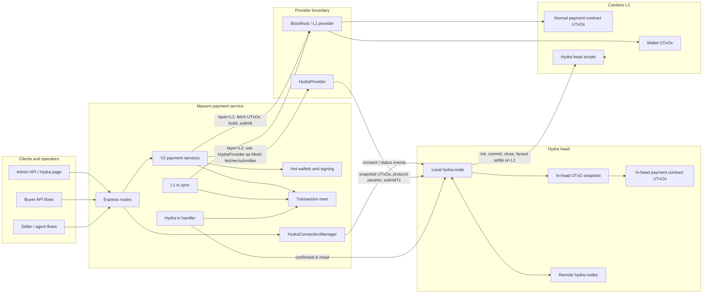
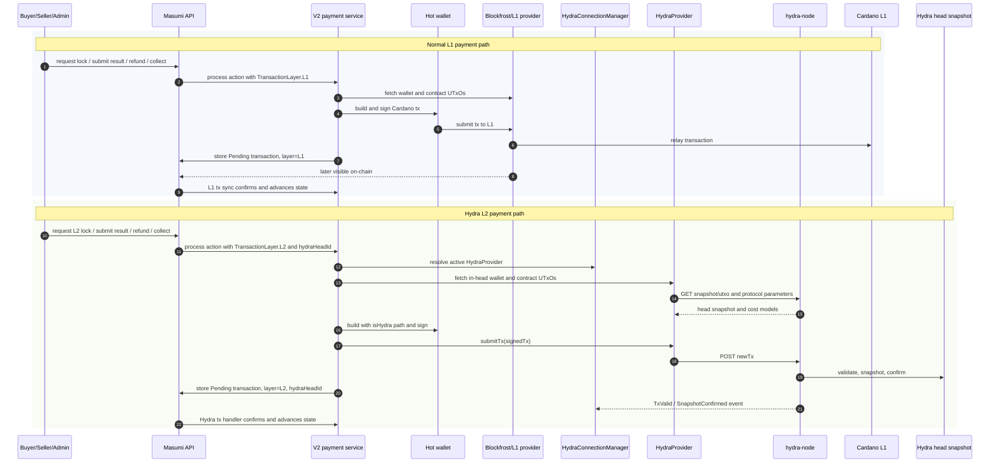

# Hydra L2 Architecture

This diagram shows how the payment service routes normal Cardano transactions and Hydra in-head transactions. Hydra is not a replacement for L1 in this system; it is an L2 execution environment that is opened, funded, closed, and finalized through L1 transactions.

## System View

## Transaction Paths

## Hydra Lifecycle

The `HydraHead.status` column blends two phases: a **connection phase** (the
WebSocket link to the local hydra-node) and the **on-chain phase** (the head's
Cardano lifecycle). The diagram shows both.

```mermaid
stateDiagram-v2
    [*] --> Disconnected
    Disconnected --> Connecting: HydraConnectionManager opens WS to local hydra-node
    Connecting --> Connected: WS established
    Connected --> Idle: Greetings(headStatus=Idle) — no head on chain yet
    Connected --> Open: Greetings(headStatus=Open) — reconnected to a live head
    Connected --> Disconnected: WS drops (auto-reconnect)
    Idle --> Initializing: Admin POST /hydra/head/init\nhydra-node posts InitTx on L1 (HeadIsInitializing)
    Initializing --> Initializing: Admin POST /hydra/head/commit\nlocal wallet UTxOs committed; remote party commits
    Initializing --> Open: hydra-node observes all commits (HeadIsOpen)
    Open --> Open: L2 escrow txs (lock / submit / refund / collect)\nand incremental commits (deposit) add funds
    Open --> Closed: Admin POST /hydra/head/close (HeadIsClosed)
    Closed --> FanoutPossible: contestation period passes (ReadyToFanout)
    FanoutPossible --> Final: Admin POST /hydra/head/fanout (HeadIsFinalized)\nfinal in-head UTxOs settle to L1
    Final --> [*]
```

### Head status model

- **Connection phase** (`src/lib/hydra/hydra/connection.ts`):
  `Disconnected → Connecting → Connected`. `HydraConnectionManager` keeps every
  enabled head connected and reconnects on drop.
- **On-chain phase** — the DB status is updated from hydra-node WS events, mapped
  in `src/lib/hydra/hydra/node.ts`:

  | hydra-node event                   | resulting status                            |
  | ---------------------------------- | ------------------------------------------- |
  | `Greetings` (carries `headStatus`) | that status (e.g. Idle / Open on reconnect) |
  | `HeadIsInitializing`               | Initializing                                |
  | `HeadIsOpen`                       | Open                                        |
  | `HeadIsClosed`                     | Closed                                      |
  | `ReadyToFanout`                    | FanoutPossible                              |
  | `HeadIsFinalized`                  | Final                                       |

### Committing / funding a head

Funds enter the head via **commits**. The `commit` endpoint drafts a commit tx
for the local participant's wallet UTxOs (hydra-node `/commit`), signs it, and
submits through the node's `/cardano-transaction`. Commits are accepted while the
head is **Initializing** (the initial commit) **or Open** (an incremental
_deposit_), so a head can open with empty commits and be funded later. On preprod
a deposit incorporates only after the node's `deposit-period` (and lags further
behind real time by the Blockfrost chain-follower drift), so committed funds
appear in the in-head snapshot minutes after the deposit lands on L1.

> `init` is bounded: it waits a fixed window to observe `HeadIsInitializing` and
> then fails with a retryable error, because a hydra-node InitTx dropped by the
> chain backend (a known Blockfrost silent-drop) is never resubmitted by the node
> and would otherwise hang the request forever.

The API stores the exact signed commit body hash and validity upper bound before
submission. A hydra-node success response is not confirmation: only an
independent Blockfrost lookup of that exact hash promotes the participant to
committed. An absent body remains reserved through its validity bound plus a
rollback/indexer grace window, preventing an ambiguous submission from being
signed and sent twice. Mainnet and Preprod use Blockfrost for this evidence;
private devnets require a separately trusted L1 observer and otherwise remain
fail-closed rather than accepting the hydra-node's own claim.

Each `HydraRelation` is a singular two-party channel. Head creation requires the
local and remote participant wallets to match that relation exactly, claims both
participants in one Serializable transaction, and permits only one non-final
head per relation. A partial unique index enforces sequential heads, while
head-row-locking assignment/status triggers enforce one remote participant on
non-final heads across replicas; the next head can be created only after the
previous head is `Final`.

Before the service signs a commit, it independently reads the head state token's
earliest L1 transaction and verifies the official Hydra `vHead` output. The Open
datum must bind the exact head ID, two-party Hydra verification-key set, and
configured contestation period. A node-reported head that does not match
those on-chain values is disabled and cannot receive a wallet signature.

For an established head, the service replays the unrotated Hydra event log on a
dedicated evidence socket. A usable replay must bind the configured parties and
head ID and restore an Open-state or signed-snapshot anchor before its terminal
`Greetings`; unsigned `Greetings`, snapshot side-load notifications, and the
current `/snapshot/utxo` response never establish that anchor. Persistence
event-log rotation is unsupported because compaction can discard the causal
anchors needed to verify later snapshot transitions. The bundled native launcher
and E2E preflight reject `PERSISTENCE_ROTATE_AFTER` /
`--persistence-rotate-after`, and the runtime permanently rejects a session that
emits `EventLogRotated`. An already-rotated head requires manual recovery or
settlement using independently verified state.

An expired L2 reservation is not released merely because its transaction is
absent from replay: `TxValid` can accept a body into the live ledger before that
body reaches a signed snapshot. The reconciler reports these reservations but
keeps their request and wallet ownership fail-closed until explicit invalidity
or a recovery protocol can resolve all competing outcomes atomically.

Close admission is likewise fail-closed. Once a `Close` command may have been
dispatched, `isClosing` remains set until an authenticated lifecycle frame
converges the durable status. A crash or ambiguous response can therefore
require operator reconciliation; elapsed time alone is never used to reopen L2
admission because the original close transaction may still land.

## What Runs Where

| Flow                    | Provider                        | UTxO source                  | Submission target                                    | Confirmation source                                     | Transaction row                                   |
| ----------------------- | ------------------------------- | ---------------------------- | ---------------------------------------------------- | ------------------------------------------------------- | ------------------------------------------------- |
| Normal payment tx       | Blockfrost / L1 provider        | L1 wallet and contract UTxOs | Cardano L1                                           | L1 tx sync                                              | `layer=L1`                                        |
| Hydra lifecycle init    | Hydra node                      | Hydra protocol state         | Cardano L1 through Hydra node                        | Hydra status event                                      | Hydra head fields                                 |
| Hydra commit            | L1 wallet plus Hydra node draft | L1 wallet UTxOs              | Cardano L1 through Hydra node `/cardano-transaction` | Independent Blockfrost lookup of exact signed body hash | participant `commitTxHash` + validity upper bound |
| Hydra in-head escrow tx | `HydraProvider`                 | Hydra snapshot UTxOs         | Hydra node `/newTx`                                  | `TxValid` / `SnapshotConfirmed`                         | `layer=L2`, `hydraHeadId`                         |
| Hydra close/fanout      | Hydra node                      | Latest head snapshot         | Cardano L1 through Hydra node                        | Hydra status event                                      | Hydra head fields                                 |

## Implementation Map

- `src/routes/api/hydra/head/index.ts`: Hydra head CRUD plus `init`, `commit`, `close`, and `fanout` endpoints.
- `src/services/hydra-connection-manager/hydra-connection-manager.service.ts`: keeps enabled heads connected, creates `HydraProvider`, and records head status events.
- `src/lib/hydra/hydra/connection.ts`: the WebSocket connection + auto-reconnect state machine (`Disconnected → Connecting → Connected`).
- `src/lib/hydra/hydra/node.ts`: one hydra-node client — sends commands (`Init`, `newTx`, `/cardano-transaction`), maps WS events to head status, and bounds `init()`.
- `src/lib/hydra/hydra/provider.ts`: Mesh-compatible fetcher/submitter for in-head UTxOs, protocol parameters, cost models, and `/newTx` submission.
- `src/services/hydra-tx-handler/hydra-tx-handler.service.ts`: confirms pending L2 transaction rows once the Hydra node reports them confirmed.
- `src/utils/hydra/resolve-hydra-head.ts`: the L1/L2 routing gate — resolves the enabled, **Open** head where the buyer HotWallet is the local participant and the seller WalletBase is the remote. Returns null otherwise, so purchases fall back to L1 when no usable head exists.
- `packages/payment-source-v2/src/utils/mesh-cost-model-sync.ts`: splices the head's cost models into the V2 mesh line so the L2 script-data-hash matches the head's ledger (prevents `PPViewHashesDontMatch`).
- `packages/payment-source-v2/src/services/**`: normal V2 actions branch by transaction layer; the batch-payments L2 pass (`processL2PurchaseLocks`) runs first and locks eligible requests into the head, else they fall through to L1.
- `prisma/seed.ts`: seeds the `HydraRelation` / `HydraHead` / participants for the V2 preprod source from the `HYDRA_*` env vars.
- `hydra-l2-flow/`: local/preprod harness that opens, funds, exercises, closes, and settles a Hydra head.

## Mental Model

Normal L1 transactions spend and create UTxOs directly on Cardano. Hydra lifecycle transactions also settle on Cardano, but their purpose is to create and finalize a head. Once the head is open, payment contract transactions are built against the head snapshot and submitted to `hydra-node`, so they are fast in-head state transitions. Closing and fanout bring the final head snapshot back to L1.
