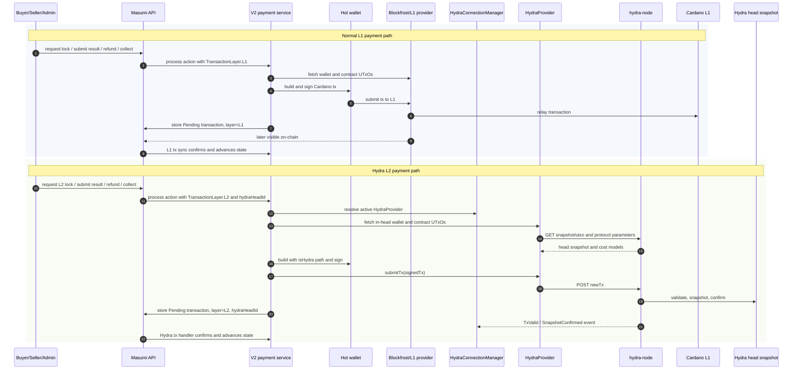
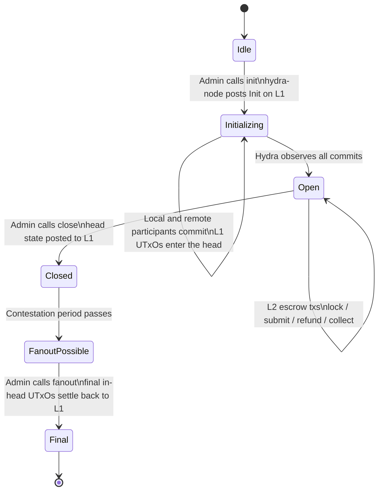

# Hydra L2 Architecture

This diagram shows how the payment service routes normal Cardano transactions and Hydra in-head transactions. Hydra is not a replacement for L1 in this system; it is an L2 execution environment that is opened, funded, closed, and finalized through L1 transactions.

## System View

```mermaid
flowchart LR
    subgraph Client["Clients and operators"]
        Admin["Admin API / Hydra page"]
        Buyer["Buyer API flows"]
        Seller["Seller / agent flows"]
    end

    subgraph Service["Masumi payment service"]
        Routes["Express routes"]
        Wallets["Hot wallets and signing"]
        V2["V2 payment services"]
        TxRows["Transaction rows"]
        L1Sync["L1 tx sync"]
        HydraManager["HydraConnectionManager"]
        HydraTxHandler["Hydra tx handler"]
    end

    subgraph Providers["Provider boundary"]
        Blockfrost["Blockfrost / L1 provider"]
        HydraProvider["HydraProvider"]
    end

    subgraph L1["Cardano L1"]
        L1WalletUtxos["Wallet UTxOs"]
        L1Escrow["Normal payment contract UTxOs"]
        HeadScripts["Hydra head scripts"]
    end

    subgraph Head["Hydra head"]
        HydraNode["Local hydra-node"]
        Snapshot["In-head UTxO snapshot"]
        L2Escrow["In-head payment contract UTxOs"]
        RemoteNodes["Remote hydra-nodes"]
    end

    Admin --> Routes
    Buyer --> Routes
    Seller --> Routes
    Routes --> V2
    Routes --> HydraManager
    V2 --> Wallets
    V2 --> TxRows

    V2 -- "layer=L1: fetch UTxOs, build, submit" --> Blockfrost
    Blockfrost --> L1WalletUtxos
    Blockfrost --> L1Escrow
    L1Sync --> Blockfrost
    L1Sync --> TxRows

    HydraManager -- "connect / status events" --> HydraNode
    HydraProvider -- "snapshot UTxOs, protocol params, submitTx" --> HydraNode
    HydraNode <--> RemoteNodes
    HydraNode --> Snapshot
    Snapshot --> L2Escrow

    V2 -- "layer=L2: use HydraProvider as Mesh fetcher/submitter" --> HydraProvider
    HydraTxHandler -- "confirmed in head" --> HydraNode
    HydraTxHandler --> TxRows

    HydraNode -- "init, commit, close, fanout settle on L1" --> HeadScripts
    HeadScripts --> L1
```

## Transaction Paths

## Hydra Lifecycle

## What Runs Where

| Flow | Provider | UTxO source | Submission target | Confirmation source | Transaction row |
| --- | --- | --- | --- | --- | --- |
| Normal payment tx | Blockfrost / L1 provider | L1 wallet and contract UTxOs | Cardano L1 | L1 tx sync | `layer=L1` |
| Hydra lifecycle init | Hydra node | Hydra protocol state | Cardano L1 through Hydra node | Hydra status event | Hydra head fields |
| Hydra commit | L1 wallet plus Hydra node draft | L1 wallet UTxOs | Cardano L1 through Hydra node `/cardano-transaction` | Hydra observes commit | participant `commitTxHash` |
| Hydra in-head escrow tx | `HydraProvider` | Hydra snapshot UTxOs | Hydra node `/newTx` | `TxValid` / `SnapshotConfirmed` | `layer=L2`, `hydraHeadId` |
| Hydra close/fanout | Hydra node | Latest head snapshot | Cardano L1 through Hydra node | Hydra status event | Hydra head fields |

## Implementation Map

- `src/routes/api/hydra/head/index.ts`: Hydra head CRUD plus `init`, `commit`, `close`, and `fanout` endpoints.
- `src/services/hydra-connection-manager/hydra-connection-manager.service.ts`: keeps enabled heads connected, creates `HydraProvider`, and records head status events.
- `src/lib/hydra/hydra/provider.ts`: Mesh-compatible fetcher/submitter for in-head UTxOs, protocol parameters, cost models, and `/newTx` submission.
- `src/services/hydra-tx-handler/hydra-tx-handler.service.ts`: confirms pending L2 transaction rows once the Hydra node reports them confirmed.
- `packages/payment-source-v2/src/services/**`: normal V2 actions branch by transaction layer; L2 actions use the Hydra provider and record `hydraHeadId`.
- `hydra-l2-flow/`: local/preprod harness that opens, funds, exercises, closes, and settles a Hydra head.

## Mental Model

Normal L1 transactions spend and create UTxOs directly on Cardano. Hydra lifecycle transactions also settle on Cardano, but their purpose is to create and finalize a head. Once the head is open, payment contract transactions are built against the head snapshot and submitted to `hydra-node`, so they are fast in-head state transitions. Closing and fanout bring the final head snapshot back to L1.
