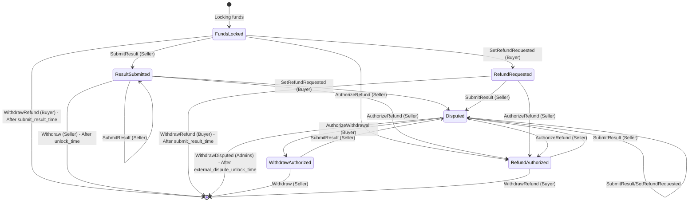

# Vested Payment Smart Contract State Machine

## States

- **FundsLocked**: Initial state when funds are locked in the contract
- **ResultSubmitted**: Seller has submitted a result hash
- **RefundRequested**: Buyer has requested a refund
- **Disputed**: Contract is in dispute state (result submitted but refund is requested)
- **WithdrawAuthorized**: Buyer has authorized seller withdrawal from a dispute
- **RefundAuthorized**: Seller has authorized buyer refund

## V2 Notes

- Datum parties are full Cardano addresses.
- Optional buyer and seller return addresses can redirect final tagged payout outputs.
- Dispute withdrawals use CIP-8 style admin signatures in the redeemer.
- Admin keys are intentionally weighted: duplicate entries in `admin_vks` count as duplicate voting slots.
- The current V2 validator does not enforce a protocol fee parameter.
- Dispute settlement values are admin-signed minimum payouts. Any remaining disputed value is an intentional submitter fee.
- Admin dispute signatures are scoped by the spent contract UTxO reference (`own_ref`).
- Buyer and seller payout checks assume their effective payout targets are distinct; deployment tooling should reject equal buyer/seller return targets unless aggregation is intended.
- Immutable validator parameters must be reviewed before deployment. The on-chain script cannot repair unreachable admin thresholds or unsuitable cooldown settings after funds are locked.

## Actions and Transitions

## Detailed Action Descriptions

### 1. **Withdraw** (Seller)

- **Triggered by**: Seller
- **From States**: ResultSubmitted, WithdrawAuthorized
- **Conditions**:
  - After unlock_time when current state is ResultSubmitted
  - No unlock_time wait when current state is WithdrawAuthorized
  - Result hash must not be empty
  - Seller must sign the transaction
  - Buyer receives at least `collateral_return_lovelace`
  - If `seller_return_address` is set, that address receives at least the contract input value minus `collateral_return_lovelace`
- **Effect**: Seller withdraws funds while returning configured collateral lovelace to the buyer

### 2. **SetRefundRequested** (Buyer)

- **Triggered by**: Buyer
- **From States**: FundsLocked, ResultSubmitted, Disputed
- **Conditions**:
  - Before unlock_time
  - After buyer_cooldown_time
  - Buyer must sign the transaction
- **To State**:
  - RefundRequested (if no result hash/from FundsLocked)
  - Disputed (if result hash exists/from ResultSubmitted or Disputed)

### 3. **AuthorizeWithdrawal** (Buyer)

- **Triggered by**: Buyer
- **From State**: Disputed
- **Conditions**:
  - After buyer_cooldown_time
  - Buyer must sign the transaction
  - Result hash must not be empty
- **To State**: WithdrawAuthorized
- **Effect**: Buyer authorizes seller withdrawal without waiting for `unlock_time`

### 4. **WithdrawRefund** (Buyer)

- **Triggered by**: Buyer
- **From States**: FundsLocked, RefundRequested, RefundAuthorized
- **Conditions**:
  - After submit_result_time, unless current state is RefundAuthorized
  - Result hash must be empty
  - Buyer must sign the transaction
- **Effect**: Buyer withdraws refund

### 5. **WithdrawDisputed** (Admins)

- **Triggered by**: Network Admins (multi-sig)
- **From State**: Disputed
- **Conditions**:
  - After external_dispute_unlock_time
  - Result hash must not be empty
  - Required weighted admin approvals must sign the dispute distribution payload
  - Buyer and seller tagged outputs must pay at least the redeemer-specified values
- **Effect**: Admins withdraw disputed funds, distribute the signed minimum payouts to the buyer and seller, and leave any remaining value as the settlement submitter fee

### 6. **SubmitResult** (Seller)

- **Triggered by**: Seller
- **From States**: Any state
- **Conditions**:
  - Before submit_result_time OR (before external_dispute_unlock_time AND result hash exists/to update to an other result hash)
  - After seller_cooldown_time
  - Seller must sign the transaction
- **To State**:
  - ResultSubmitted (if from FundsLocked or ResultSubmitted)
  - Disputed (from any other state)

### 7. **AuthorizeRefund** (Seller)

- **Triggered by**: Seller
- **From States**: FundsLocked, ResultSubmitted, RefundRequested, Disputed
- **Conditions**:
  - After seller_cooldown_time
  - Seller must sign the transaction
  - New result hash must be empty
  - Contract value remains locked in a continuing output
- **To State**: RefundAuthorized
- **Effect**: Seller authorizes buyer refund without waiting for `submit_result_time`

## Key Time Constraints

- **pay_by_time**: Payment deadline
- **submit_result_time**: Deadline for seller to submit result
- **unlock_time**: When seller can withdraw funds
- **external_dispute_unlock_time**: When admins can resolve disputes
- **seller_cooldown_time**: Cooldown period for seller actions
- **buyer_cooldown_time**: Cooldown period for buyer actions

## Cooldown Mechanism

Both buyer and seller have cooldown periods to prevent rapid state changes:

- After any action, the actor must wait for their cooldown period before taking another action

## Dispute Voting

`admin_vks` is a weighted list. A verification key hash may appear more than once, and each occurrence counts toward `required_admins_multi_sig` when the corresponding admin signature is valid. Deployment configuration should make this weighting explicit so a repeated key is reviewed as intentional governance policy.

The signed dispute payload includes the spent contract UTxO reference (`own_ref`) plus the buyer and seller minimum payout values. `own_ref` binds each admin approval to a specific disputed contract UTxO, so approvals are not reusable across different contract UTxOs. Admin tooling should always derive and display the payload from the target UTxO before collecting signatures.
