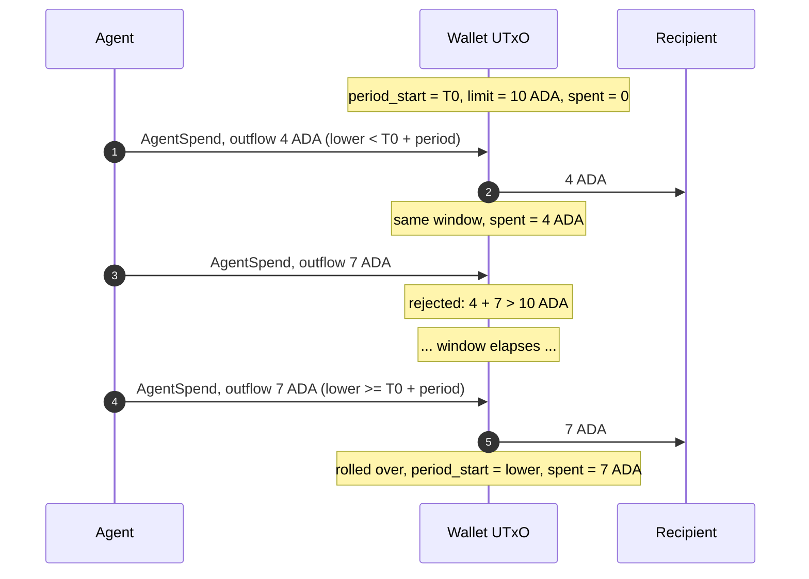
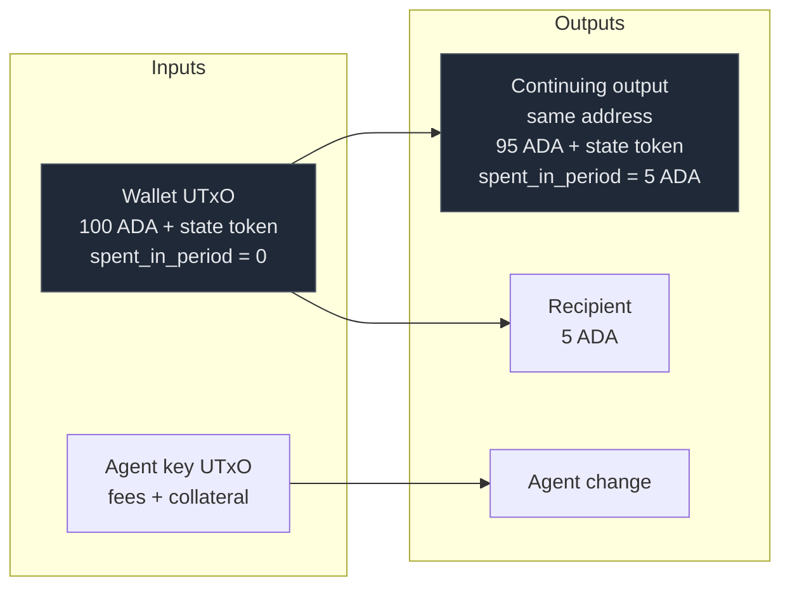
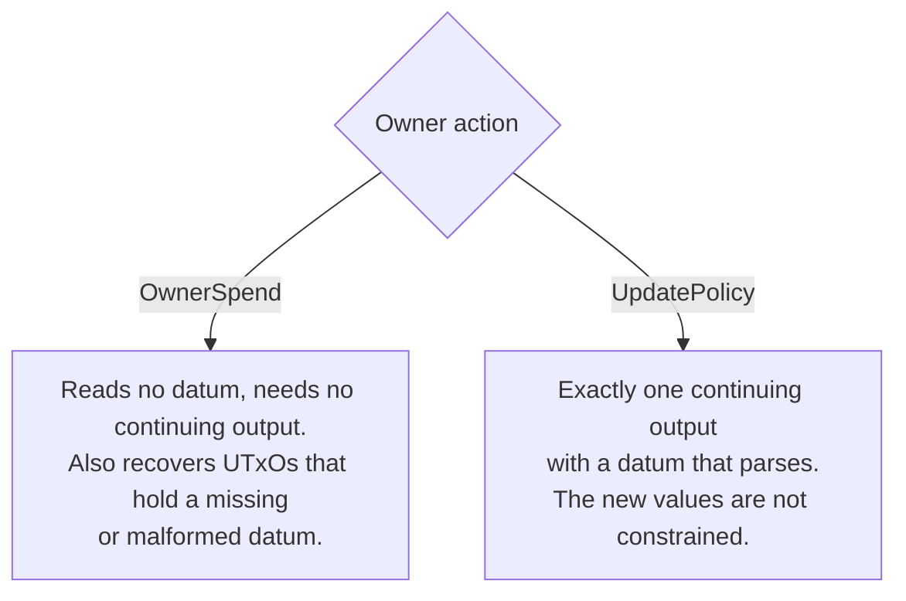

# Smart Wallet Lifecycle

The wallet is not a state machine like the payment contract. Each wallet is
one long-lived UTxO, identified by its state token. The datum carries the
budget counters. A transaction changes who may spend and how much budget
remains. It does not change a state tag.

Several wallets can share one address. Each token is one wallet. No two
wallets can settle in the same transaction.

## Lifecycle

## Budget window

Each wallet has one window and one set of counters. A spend adds to the open
window, or it opens a fresh window. It never does both, and no backlog of
windows accrues.

On a roll-over, the validator sets `period_start` to the lower bound of the
validity range. It also requires `upper <= lower + period_length`. The ledger
keeps the current time inside the validity range. Therefore the new window
must contain the present. An agent that was idle for a week gets one window of
budget, not seven.

## Shape of an agent spend

The outflow is 100 − 95 = 5 ADA. The validator charges this amount to the
budget. The state token stays in place: it has no limit entry, and assets
without a limit entry cannot move in either direction. The same rule stops an
NFT from leaving the wallet.

Foreign script inputs may appear in the transaction. The primary case is a
lock into the payment escrow. A second input of the wallet script may not
appear. Two wallets cannot settle together, so each ceiling stays independent.

## Owner paths

