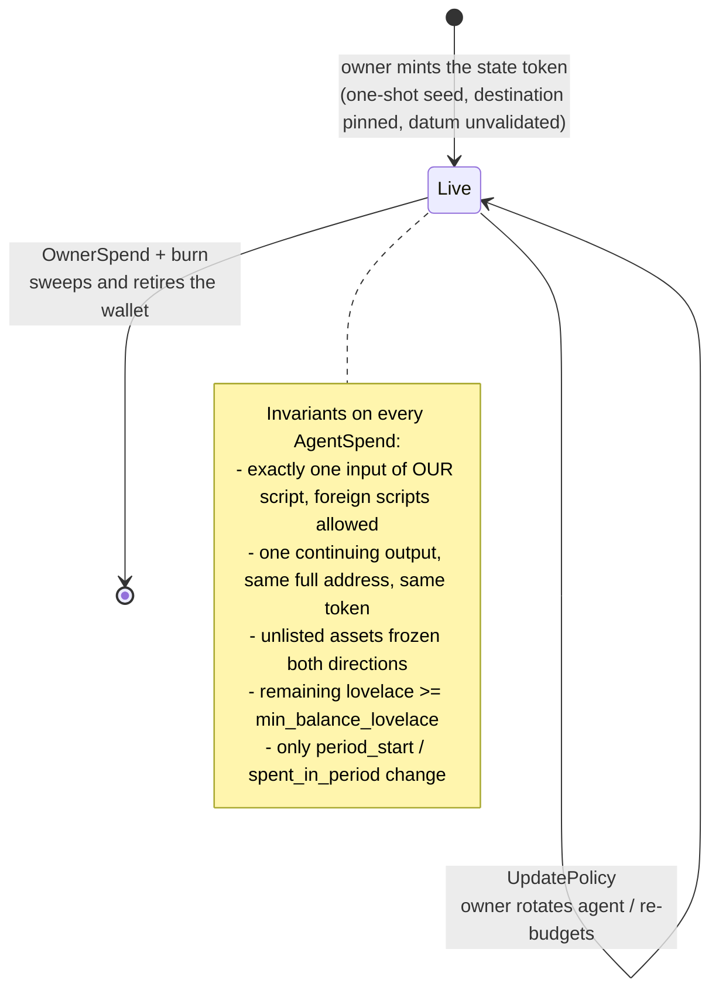
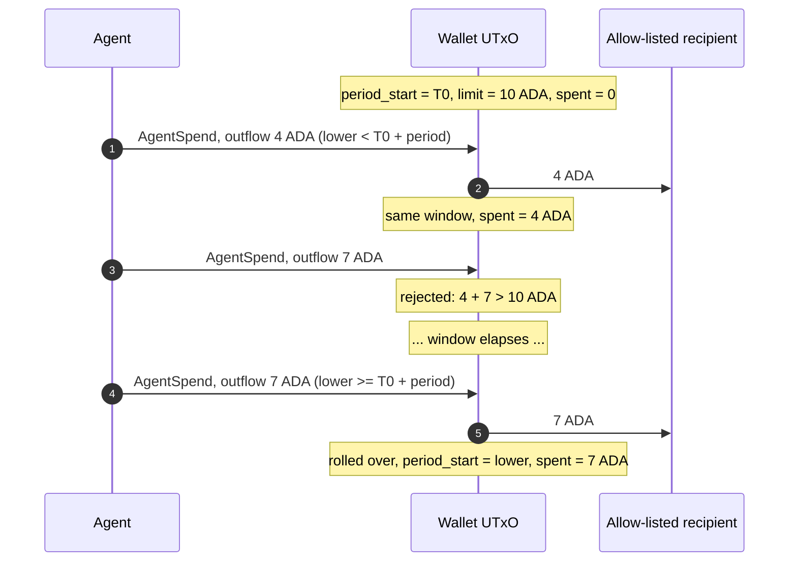
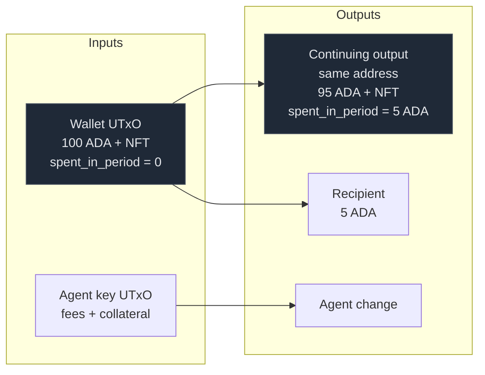
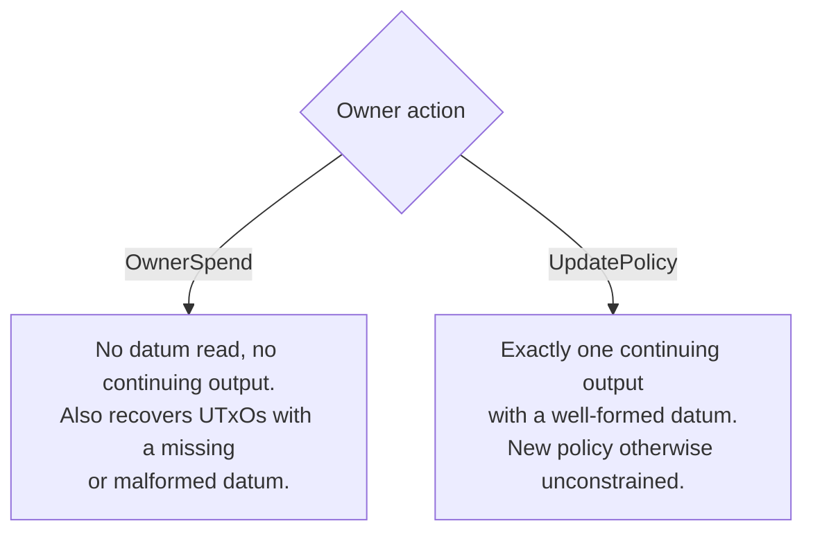

# Smart Wallet Lifecycle

The wallet is not a state machine in the sense the payment contract is: each
wallet is one long-lived UTxO — identified by its state token — whose datum
carries mutable budget accounting. What changes across transactions is *who*
may spend and *how much is left in the window*, not a discrete state tag.
Several wallets can share the address; each token is one wallet, and no two
ever settle in the same transaction.

## Lifecycle

## Budget window

`period_start` and `spent_in_period` are per wallet. A spend either accumulates
inside the open window or opens a fresh one — never both, and never a backlog.

Roll-over sets `period_start` to the transaction's lower bound and requires
`upper <= lower + period_length`. The ledger guarantees `lower <= now <= upper`,
so the new window must contain the present. An agent that has been idle for a
week therefore gets one window's budget, not seven.

## Agent spend transaction shape

`outflow = 100 − 95 = 5 ADA`, which is what the budget is charged. The state
token rides through untouched: it is unlisted in `limit`, and unlisted assets
are frozen in both directions — the same rule that stops an NFT walking out.

Foreign script inputs may appear — locking into the payment escrow is the
primary case — but never a second input of the wallet's own script: two shards
cannot settle together, which keeps each wallet's ceiling independent.

## Owner paths

